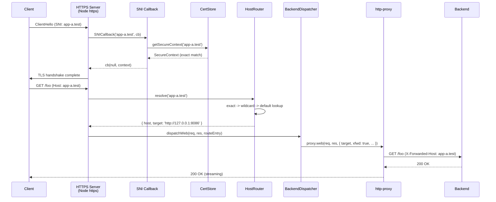
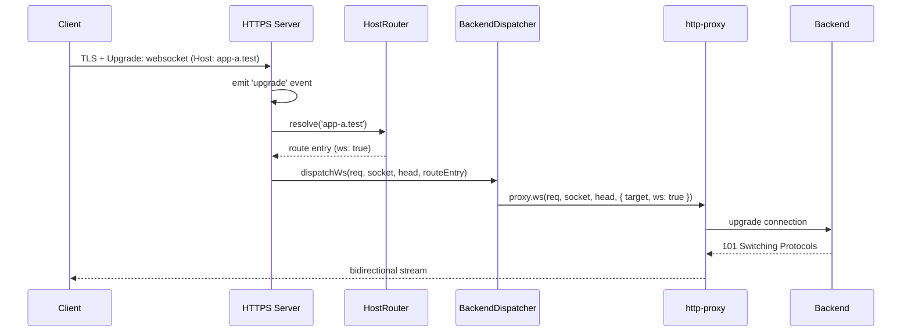
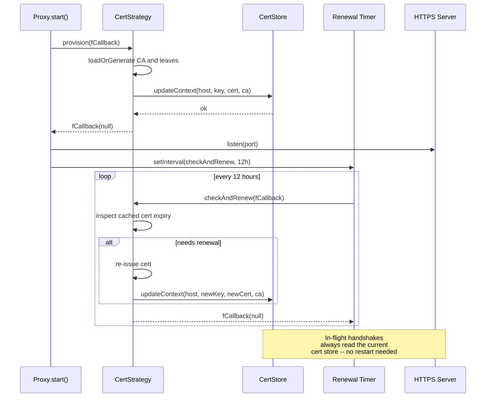
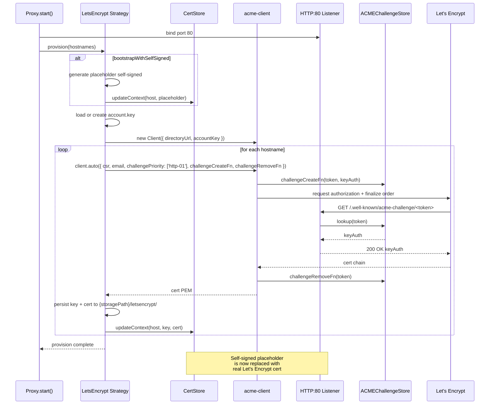
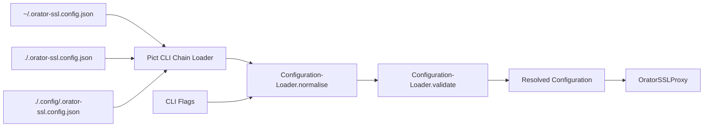

# Architecture

Orator SSL Proxy is built as a Fable service provider that wires together a handful of small, focused components. The design goal is a reusable piece of infrastructure that can either compose into an existing Retold application or run completely standalone, with zero dependency on `orator` or `orator-serviceserver-restify` on the hot path.

## Layered Design

```
┌─────────────────────────────────────────────┐
│                   Fable                     │
│        (Configuration, Logging, DI)         │
└─────────────────────┬───────────────────────┘
                      │
┌─────────────────────▼───────────────────────┐
│             OratorSSLProxy                  │
│  (Service Provider Lifecycle, Orchestration)│
└───┬────────┬──────────┬────────────┬────────┘
    │        │          │            │
┌───▼──┐ ┌───▼──┐ ┌─────▼──────┐ ┌───▼──────┐
│ HTTPS│ │ HTTP │ │HostRouter  │ │CertStore │
│Server│ │Server│ │+ BackendDis│ │+ Strategy│
│Factory│ │Factory││patcher    │ │ (Self/LE)│
└──────┘ └──────┘ └────────────┘ └──────────┘
```

- **Fable** provides the service provider base, logging, and configuration primitives.
- **OratorSSLProxy** is the top-level orchestrator: reads config, builds everything, starts the servers, stops them gracefully.
- **HTTPS / HTTP server factories** build the two listening sockets. They delegate routing decisions to the host router and dispatching decisions to the backend dispatcher.
- **Host router + backend dispatcher** handle request dispatch. The router maps a `Host` header to a route entry; the dispatcher forwards the raw Node `IncomingMessage` to the target backend via `http-proxy`.
- **Cert store + strategy** provide per-hostname TLS contexts. Strategies (`selfsigned`, `letsencrypt`, `file`) populate the store at boot and refresh it during renewal checks.

## Hot Path: Does Not Touch Orator or Restify

A deliberate design decision: traffic dispatched through the proxy **does not** go through Orator, Restify, or any Retold framework layer. The HTTPS server is a native `https.createServer`, the request listener is a plain `(req, res) => ...`, and forwarding goes straight into `http-proxy.web()`. The only reason the module extends `FableServiceProviderBase` at all is for lifecycle, logging, and configuration management. This keeps three things clean:

1. **Stream integrity** -- bodies flow through as `IncomingMessage` -> `http-proxy` pipe without any body parser intercepting them.
2. **Dispatch axis** -- the whole reason this module exists is to dispatch by `Host` header, which doesn't map cleanly to Orator/Restify's URL-path-based route registry.
3. **No module coupling** -- the module can be consumed by any Retold app without pulling in the whole Orator stack.

## Request Lifecycle



The router's resolution order is:

1. **Exact match** in the configured routes list
2. **Longest wildcard match** (`*.dev.example.com` beats `*.example.com`)
3. **Default fall-through** via `config.default.target`
4. **No match** -> 502 with a clear error body

## WebSocket Upgrades



The router is the same. The dispatcher calls `proxy.ws()` instead of `proxy.web()`. Routes can opt out of WebSocket forwarding per-entry with `"ws": false`.

## Cert Strategies and SNI

The cert store is a mutable `Map<hostname, SecureContext>` keyed by exact hostname, with a sorted wildcard list and a single `*` default. The SNI callback reads the store on every TLS handshake, so strategies that renew certs in the background (Let's Encrypt, periodic self-signed regeneration) can swap entries live without restarting the listening socket.



## Local CA Design (selfsigned / localCA)

The recommended dev-mode strategy is a miniature two-tier PKI built with `node-forge`:

- **Root CA** -- generated on first boot and persisted to `{storagePath}/selfsigned/ca.{key,cert}`. 10-year validity, RSA 2048, marked `cA: true` with `keyCertSign`, `cRLSign`, and `digitalSignature` key usages. Never directly presented during TLS handshakes.
- **Leaf certs** -- one per hostname. 1-year validity by default, signed with the CA's private key, `cA: false`, `extKeyUsage.serverAuth: true`, and always include a `subjectAltName` list covering the target hostname plus `localhost`, `127.0.0.1`, and `::1`. SANs are mandatory -- all modern browsers reject CN-only certs.
- **Chain presented to clients** -- leaf + CA concatenated in the `cert` field of the `SecureContext`, so clients that already trust the CA can build a complete chain immediately.
- **Trust install** -- the `cert-install-root-ca` CLI command copies the CA root cert into the OS trust store (macOS keychain, Linux system anchors, Windows certstore, Firefox NSS) so browsers trust every leaf the proxy ever issues, now or in the future, for any hostname.

This is the same pattern popularized by [`mkcert`](https://github.com/FiloSottile/mkcert), implemented in pure JavaScript so no external binary is required.

## Let's Encrypt Flow (selfsigned -> real)

When the `letsencrypt` strategy is active:



Port 80 **must** be reachable from the public internet for HTTP-01 to complete. Staging is the default (`certs.letsencrypt.staging: true`) so repeated dev runs don't hit production rate limits. Flip to production only after verifying the flow end-to-end.

Renewals piggyback on the same 12-hour timer as the self-signed strategy. A cached cert within its renewal window is silently reused; one outside it triggers a fresh `client.auto()` call.

## Configuration Flow



`pict-service-commandlineutility` provides the multi-folder loader for free, including the `explain-config` mixin command. The configuration loader deep-merges those files over the built-in defaults, expands `~` in paths, resolves null ports to hashed defaults, normalises route entries, and validates the final shape before handing it to the service provider.

## Component Reference

| Component | File | Responsibility |
|-----------|------|----------------|
| `OratorSSLProxy` | `source/Orator-SSL-Proxy.js` | Service provider; `start()` / `stop()` lifecycle |
| `SSLProxyHostRouter` | `source/router/SSL-Proxy-HostRouter.js` | Host-header to route-entry resolution |
| `SSLProxyBackendDispatcher` | `source/router/SSL-Proxy-BackendDispatcher.js` | `http-proxy` wrapper with shared error handling |
| `SSLProxyCertStore` | `source/certs/SSL-Proxy-CertStore.js` | In-memory `SecureContext` map with SNI lookup |
| `SSLProxyCertStrategyBase` | `source/certs/SSL-Proxy-CertStrategy-Base.js` | Abstract base for cert strategies |
| `SSLProxyCertStrategySelfSigned` | `source/certs/SSL-Proxy-CertStrategy-SelfSigned.js` | Self-signed with `localCA` and `adhoc` modes |
| `SSLProxyCertStrategyLetsEncrypt` | `source/certs/SSL-Proxy-CertStrategy-LetsEncrypt.js` | ACME HTTP-01 via `acme-client` |
| `SSLProxyCertStrategyFile` | `source/certs/SSL-Proxy-CertStrategy-File.js` | Bring-your-own PEMs |
| `SSLProxyLocalCA` | `source/certs/SSL-Proxy-LocalCA.js` | `node-forge` CA and leaf cert generation |
| `SSLProxyACMEChallengeStore` | `source/certs/SSL-Proxy-ACMEChallengeStore.js` | Token store shared by LetsEncrypt strategy and HTTP:80 listener |
| `SSLProxyTrustStoreInstaller` | `source/certs/SSL-Proxy-TrustStore-Installer.js` | Platform-aware OS trust-store install/uninstall |
| `SSLProxyHTTPSServerFactory` | `source/server/SSL-Proxy-HTTPSServerFactory.js` | Builds the `https.Server` with SNI + upgrade handler |
| `SSLProxyHTTPServerFactory` | `source/server/SSL-Proxy-HTTPServerFactory.js` | Builds the port 80 companion server |
| `SSLProxyConfigurationLoader` | `source/config/SSL-Proxy-Configuration-Loader.js` | Deep-merge, normalise, validate |
| `SSLProxyPortHasher` | `source/util/SSL-Proxy-Port-Hasher.js` | Deterministic default-port hasher |

## Design Trade-Offs

**Why not use Orator's existing `orator-http-proxy`?** That module dispatches by URL path via Orator's route registry. The whole point of this module is dispatching by `Host` header, a different axis. Bolting host-header matching onto orator-http-proxy would require every request to go through Orator, Restify's body parsers, and a catch-all `/*` route -- unnecessary overhead and a worse fit for streaming.

**Why `node-forge` instead of `selfsigned`?** The `selfsigned` npm package only issues stand-alone self-signed certs; it has no concept of a CA that signs other certs. `node-forge` lets us build a proper two-tier PKI with a root CA and leaves. It's already a transitive dep of `selfsigned`, so switching to it directly costs us nothing.

**Why `acme-client` instead of `greenlock`?** `acme-client` is the minimal, actively maintained direct ACME v2 client with HTTP-01 support. `greenlock` is more batteries-included but has been through several maintenance churns and has opinionated storage layouts that would conflict with ours.

**Why hashed default ports instead of 443/80?** Two reasons: (1) so local dev doesn't need `sudo` on macOS/Linux (binding to 443 requires root), and (2) so multiple Retold dev servers from different packages don't collide on the same port. The Docker image explicitly overrides to 443/80 in its `CMD` because inside the container we always run as root.

**Why a shared `http-proxy` instance instead of one per route?** Simpler, cheaper, and `http-proxy` already handles concurrent targets via per-call options. Per-route instances would allow per-backend timeouts and header rewriting, but that's a minor feature that can be added later without changing the API.
